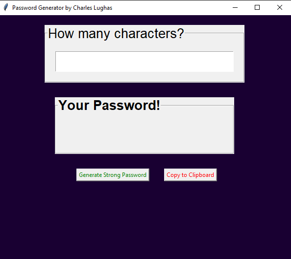

# Password Generator Application

Generate strong and secure passwords with this Python-based Password Generator Application created with Tkinter GUI.



## Features

- **Customizable Passwords:** Generate passwords with varying lengths and complexity.
- **Copy to Clipboard:** Easily copy generated passwords to your clipboard for immediate use.

## How to Use

1. **Generate Password:**
   - Select your preferred password length using the slider.
   - Click the "Generate Password" button.
   - The generated password will appear in the text field.
   
2. **Copy to Clipboard:**
   - Click the "Copy to Clipboard" button to copy the generated password to your clipboard.


## Installation

Clone the repository to your local machine:

```bash
git clone https://github.com/lordlughas/CODSOFT/password_generator.git

Run the application:
`python password.py`
```
## Requirements
  * Python 3.x
  * Tkinter library (usually included with Python)

## License
This project is licensed under the MIT License

## Acknowledgments
Thanks to the [Python](https://python.org) and [Tkinter](https://docs.python.org/3/library/tkinter.html) communities for their excellent documentation and resources. Also a sincere appreciation goes to @CODSOFT for the internship opportunity given to me that brought about this project.

## Resources
- [Python](https://python.org)
- [Tkinter](https://docs.python.org/3/library/tkinter.html)
- [Geeksforgeeks Tutorial](https://www.geeksforgeeks.org/python-gui-tkinter/)
- [Codemy](https://youtube.com/Vm0ivVxNaA8?si=0989P1RDKZRabFz)

# Author
[Charles Lughas](https://github.com/lordlughas)
