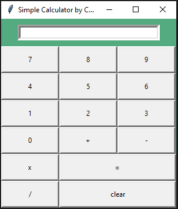

# Simple Calculator with Tkinter GUI

Welcome to the Simple Calculator with Tkinter GUI repository! This Python program creates a basic calculator application with a graphical user interface using the Tkinter library. It allows users to perform simple arithmetic operations.



## Table of Contents

1. [Description](#description)
2. [Getting Started](#getting-started)
3. [Usage](#usage)
4. [Features](#features)
5. [Contributing](#contributing)
6. [License](#license)

## Description

This Python program creates a simple calculator with a graphical user interface (GUI) using the Tkinter library. The calculator supports basic arithmetic operations such as addition, subtraction, multiplication, and division. Users can enter numbers and perform calculations by clicking the corresponding buttons on the GUI.

## Getting Started

To get started with this calculator, follow these steps:

1. Clone this repository to your local machine:

   ```bash
   git clone https://github.com/your-username/simple_calculator.git
   ```
2. Navigate to the folder:
   `cd simple_calculator`
3. Run the calculator application:
   `python calculator.py`

## Usage
* Enter numbers by clicking the number buttons (0-9).
* Perform arithmetic operations by clicking the operation buttons (+, -, x, /).
* Click the "=" button to calculate the result.
* Click the "Clear" button to clear the input field.
* The result will be displayed in the input field.

## Features
* User-friendly graphical user interface (GUI).
* Supports addition, subtraction, multiplication, and division.
* Easy-to-use buttons for numeric input and operations.
* Clear button to reset the input field.
* Calculates and displays results accurately.

## Contributing
Contributions to this repository are welcome! If you have suggestions for improvements, bug fixes, or new features, please feel free to fork the repository and submit a pull request. We appreciate your contributions.

## License
This repository and its contents are licensed under the MIT License. You are free to use, modify, and distribute this code for personal or commercial purposes.

## Acknowledgments
Thanks to the [Python](https://python.org) and [Tkinter](https://docs.python.org/3/library/tkinter.html) communities for their excellent documentation and resources. Also a sincere appreciation goes to @CODSOFT for the internship opportunity given to me that brought about this project.

## Resources
- [Python](https://python.org)
- [Tkinter](https://docs.python.org/3/library/tkinter.html)
- [Geeksforgeeks Tutorial](https://www.geeksforgeeks.org/python-gui-tkinter/)
- [Codemy](https://youtube.com/codemy)

# Author
[Charles Lughas](https://github.com/lordlughas)
